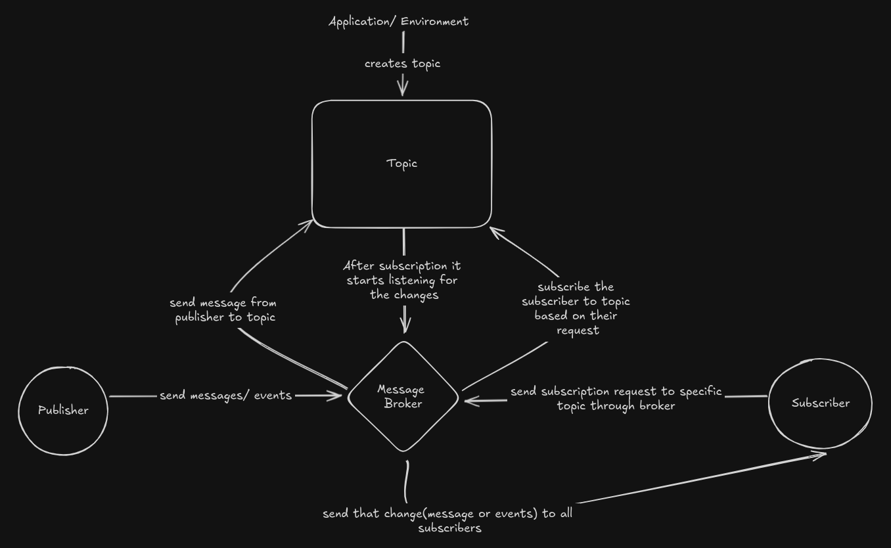

# Pubsub layer

> [!note]
> Here message are also called events

- A messaging pattern use for asyncronous communication by sending and receiving message.
- **Key Concepts** :
    1. Publisher
        - Pushes message into central server or message broker
        - Know nothing about who will consume this message a.k.a **subscribber**
    2. Subscriber
        - Receives the message
        - No idea about who pushes the message.
        - Only know about **Topic** they subscribbed to
    3. Topic
        - Logic channel for messages
        - Publisher push messages to this topic and Subscribers subscribe to this topic to get message
    4. Message Broker
        - Handles routing of messages between  publisher and subscriber
        - It ensures that any message published to topic should deliver to all subscribers



## Code Example

Below I made a implementation of pubsub model using js
```javascript
```javascript
class Subscriber {
    constructor(name) {
        this.name = name;
    }

    receiveMessage(topicName, message) {
        console.log(`Subscriber '${this.name}' received message on '${topicName}': ${message}`);
    }
}

class MessageBroker {
    constructor() {
        this.topics = {};
    }

    subscribe(topicName, subscriber) {
        if (!this.topics[topicName]) {
            this.topics[topicName] = [];
        }
        this.topics[topicName].push(subscriber);
        console.log(`Subscriber '${subscriber.name}' subscribed to '${topicName}'`);
    }

    publish(topicName, message) {
        if (!this.topics[topicName]) {
            console.log(`Topic '${topicName}' does not exist.`);
            return;
        }
        console.log(`Publishing message to topic '${topicName}': ${message}`);
        this.topics[topicName].forEach(subscriber => {
            subscriber.receiveMessage(topicName, message);
        });
    }
}

class Publisher {
    constructor(broker) {
        this.broker = broker;
    }

    publishMessage(topicName, message) {
        this.broker.publish(topicName, message);
    }
}

// Example Usage
const broker = new MessageBroker();
const alice = new Subscriber('Alice');
const bob = new Subscriber('Bob');

broker.subscribe('sports', alice);
broker.subscribe('sports', bob);
broker.subscribe('news', bob);

const publisher = new Publisher(broker);

publisher.publishMessage('sports', 'Team A won the match!');
publisher.publishMessage('news', 'New policy changes announced.');
publisher.publishMessage('entertainment', 'Movie X released this week!');
```
